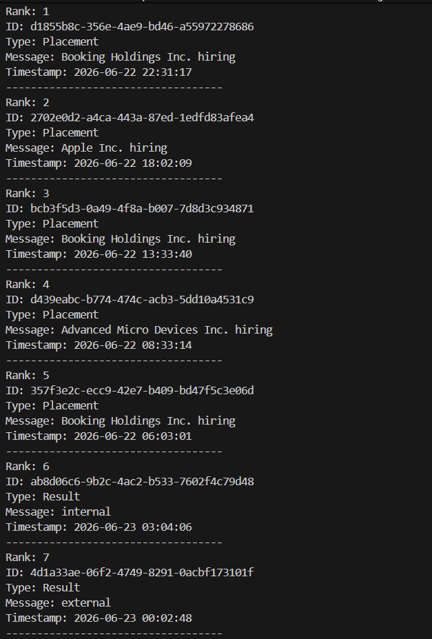
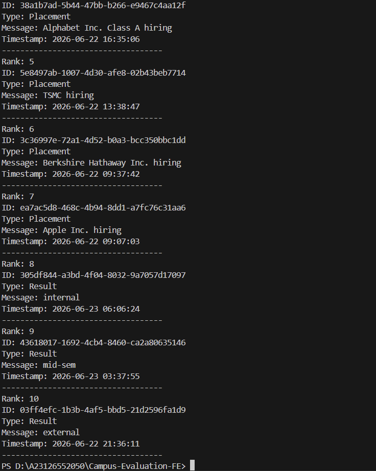

Notification System Design — Priority Inbox
What this is about

This system pulls notifications from an API and always shows the top 10 most important unread ones.

Importance is based on two things:

Type of notification
How recent it is

Priority order is simple:
Placement > Result > Event

Data we get
{
  "notifications": [
    {
      "ID": "uuid",
      "Type": "Placement | Result | Event",
      "Message": "text",
      "Timestamp": "YYYY-MM-DD HH:MM:SS"
    }
  ]
}
How priority works
Type matters first
Type	Priority
Placement	Highest (3)
Result	Medium (2)
Event	Lowest (1)

So yeah, Placement always wins.

If same type, time decides

If two notifications are the same type, the newer one comes first.

Example:

Result @ 17:51:30 beats Result @ 17:50:54
How it works step by step
Fetch notifications from the API
Assign a weight based on type
Sort them (first by type, then by time)
Pick the top 10

That’s it.

Screenshot — What the inbox looks like

Performance
Fetching: O(n)
Sorting: O(n log n)
Picking top 10: basically instant

Overall: O(n log n)

Better approach (if this scales)

If notifications are coming in constantly, sorting everything every time is wasteful.

Instead, you keep a small priority queue (min heap) of size 10:

Every new notification gets inserted
If it exceeds 10, remove the least important one

This keeps things fast and lightweight.

Screenshot —
](output1.png)
